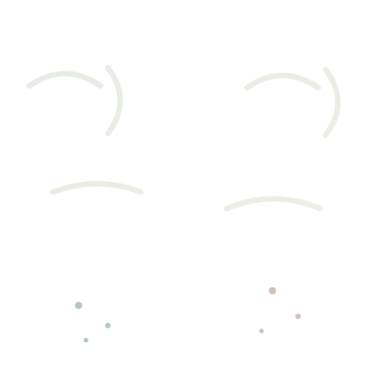

# 🥔 RAPPORT DE PROJET DE FIN D'ÉTUDES (PFE)

---

## 📅 SESSION : MAI 2026
## 🏫 INSTITUTION : ÉCOLE SUPÉRIEURE DE TECHNOLOGIE (EST) À OUJDA
## 🎓 DÉPARTEMENT : INFORMATIQUE, DÉCISION ET INTELLIGENCE ARTIFICIELLE (IDIA)

---

# **DÉTECTION AUTOMATISÉE DU MILDIOU CHEZ LA POMME DE TERRE PAR VISION PAR ORDINATEUR ET DEEP LEARNING (YOLOv8)**

---

### **Présenté par :** HAMZA
### **Encadré par :** M. MOUNIR GRARI

---

  
   
  <em>"L'Intelligence Artificielle au service de la productivité agricole"</em>

---

## **REMERCIEMENTS**

Je tiens à exprimer ma profonde gratitude à mon encadrant, **M. Mounir Grari**, pour son orientation, ses précieux conseils et son soutien constant tout au long de la réalisation de ce projet.

Mes remerciements s'adressent également à l'ensemble du corps professoral de l'**EST Oujda** pour la qualité de la formation reçue durant ces années d'études. Enfin, je remercie tous ceux qui ont contribué, de près ou de loin, à l'aboutissement de ce travail.

---

## **RÉSUMÉ**

Ce projet porte sur le développement d'un système intelligent de détection du mildiou (*Phytophthora infestans*) chez les plants de pomme de terre en utilisant des techniques avancées de vision par ordinateur. Grâce au modèle de Deep Learning **YOLOv8**, nous avons conçu une application capable d'identifier en temps réel les stades précoces et avancés de la maladie à partir d'images ou de vidéos. Le système est déployé sur une architecture cloud moderne utilisant **FastAPI**, **Docker**, **Hugging Face** pour le backend, et une interface web interactive hébergée sur **Netlify**.

**Mots-clés :** Vision par ordinateur, YOLOv8, Mildiou, Agriculture de précision, Deep Learning, FastAPI.

**ABSTRACT**

This project focuses on developing an intelligent detection system for potato late blight using advanced computer vision techniques. By leveraging the **YOLOv8** Deep Learning model, we designed an application capable of identifying early and late stages of the disease in real-time from images or videos. The system is deployed via a modern cloud architecture using **FastAPI**, **Docker**, and **Hugging Face** for the backend, with an interactive web interface hosted on **Netlify**.

**Keywords:** Computer Vision, YOLOv8, Potato Blight, Precision Agriculture, Deep Learning, FastAPI.

---

## **SOMMAIRE**

1.  **Introduction Générale**
2.  **Chapitre 1 — Généralités sur la vision par ordinateur et l’agriculture de précision**
3.  **Chapitre 2 — Deep Learning pour la détection le suivi et le comptage**
4.  **Chapitre 3 — Implémentation des modèles Deep Learning**
5.  **Chapitre 4 — Résultats limitations et perspectives**
6.  **Conclusion Générale**
7.  **Annexes**

---

# **INTRODUCTION GÉNÉRALE**

### **Contexte général du projet**
L'agriculture marocaine est un pilier de l'économie nationale, mais elle reste vulnérable aux maladies cryptogamiques qui menacent la sécurité alimentaire. La culture de la pomme de terre, en particulier, subit de lourdes pertes dues au **mildiou**, une maladie dévastatrice qui peut détruire des récoltes entières en quelques jours si elle n'est pas traitée à temps.

### **Problématique**
La méthode traditionnelle de détection du mildiou repose sur l'inspection visuelle manuelle par les agriculteurs, ce qui est chronophage, sujet à l'erreur humaine et souvent trop tardif. Il existe un besoin pressant d'outils numériques automatisés (OAD - Outils d'Aide à la Décision) capables de surveiller les parcelles avec précision et rapidité.

### **Objectifs du PFE**
L'objectif principal de ce projet est de concevoir et déployer une solution logicielle intelligente capable de :
1.  **Détecter** automatiquement les symptômes du mildiou sur les feuilles.
2.  **Classifier** le stade de la maladie (Early vs Late Blight).
3.  **Compter** les plants sains et infectés pour évaluer le niveau de risque global.
4.  **Offrir** une interface accessible aux agriculteurs via le web.

### **Méthodologie adoptée**
Nous avons adopté une approche de développement agile intégrant :
*   La collecte et l'augmentation d'un dataset spécifique.
*   L'entraînement d'un modèle **YOLOv8** pour la détection d'objets.
*   Le développement d'une API backend robuste.
*   Le déploiement continu sur des infrastructures Cloud.

---

# **CHAPITRE 1 — GÉNÉRALITÉS SUR LA VISION PAR ORDINATEUR ET L’AGRICULTURE DE PRÉCISION**

### **Introduction à la vision par ordinateur**
La vision par ordinateur est une branche de l'intelligence artificielle qui permet aux machines de "voir" et d'interpréter le monde visuel. En utilisant des algorithmes sophistiqués, elle peut extraire des informations significatives à partir d'images numériques ou de vidéos.

### **Algorithmes classiques de détection**
Historiquement, la détection d'objets passait par des extracteurs de caractéristiques manuels (SIFT, HOG). Cependant, l'avènement du Deep Learning, et particulièrement des réseaux de neurones convolutifs (**CNN**), a révolutionné le domaine en permettant au modèle d'apprendre par lui-même les caractéristiques discriminantes.

### **Introduction à l’agriculture de précision**
L'agriculture de précision consiste à utiliser les technologies numériques pour optimiser les rendements et minimiser l'impact environnemental. Elle permet de traiter chaque parcelle ou chaque plant individuellement plutôt qu'uniformément.

### **Technologies émergentes en agriculture**
*   **Drones** : Pour la surveillance aérienne multispectrale.
*   **Capteurs IoT** : Pour mesurer l'humidité et la température favorisant le mildiou.
*   **IA & Vision** : Pour le diagnostic instantané des maladies foliaires.

### **Applications pratiques**
La vision par ordinateur permet aujourd'hui :
*   Le pulvérisage ciblé d'herbicides.
*   Le tri automatisé des récoltes.
*   La détection précoce des foyers d'infection, comme nous le proposons dans ce PFE.

---

# **CHAPITRE 2 — DEEP LEARNING POUR LA DÉTECTION, LE SUIVI ET LE COMPTAGE**

### **Fondements du Deep Learning appliqué à la vision**
Le Deep Learning (Apprentissage Profond) utilise des couches successives de neurones artificiels pour apprendre des représentations de données complexes. Pour les images, les réseaux convolutifs (**CNN**) sont les plus efficaces car ils préservent la structure spatiale.

### **Techniques de détection d’objets (YOLOv8)**
**YOLO** (You Only Look Once) est un modèle de détection d'objets en temps réel qui traite l'image en un seul passage, ce qui le rend extrêmement rapide. La version **v8** (par *Ultralytics*) apporte des améliorations majeures en termes de précision et de modularité.

### **Méthodes de suivi d’objets (Tracking)**
Le système utilise les capacités natives de suivi de YOLOv8. Le suivi permet d'assigner un identifiant unique à chaque plant détecté, ce qui est crucial pour éviter le double comptage lors de l'analyse d'une vidéo.

### **Approches de comptage**
Le comptage est réalisé par sommation des boîtes de délimitation (**bounding boxes**) générées pour chaque classe spécifique (Healthy, Early, Late). L'algorithme calcule ainsi une répartition statistique des maladies sur l'échantillon fourni.

### **Métriques d’évaluation**
*   **Précision (Precision)** : Qualité des détections (éviter les faux positifs).
*   **Rappel (Recall)** : Capacité à trouver tous les objets (éviter les faux négatifs).
*   **mAP50** : Moyenne de la précision moyenne, indicateur global de performance.

---

# **CHAPITRE 3 — IMPLÉMENTATION DES MODÈLES DEEP LEARNING**

### **Outils et technologies utilisés**
*   **Python** : Langage principal.
*   **FastAPI** : Framework backend moderne pour créer l'API de détection.
*   **Ultralytics YOLOv8** : Pour l'entraînement et l'inférence.
*   **OpenCV** : Pour le pré-traitement des images et le dessin des masques.

### **Environnement de développement**
Le développement a été effectué localement avec un script `run_all.bat` pour automatiser l'installation des dépendances (PyTorch, etc.) et le démarrage du serveur.

### **Préparation des données (Data Augmentation)**
*   **Dataset Initial** : Environ **70 images** réelles collectées.
*   **Augmentation** : Pour améliorer la robustesse du modèle et éviter l'overfitting, nous avons appliqué des transformations (Rotation, Flip, Resize) pour atteindre un dataset final de plus de **900 images**. Cette étape est cruciale pour compenser le faible nombre de données initiales.

### **Entraînement du modèle**
L'entraînement a été finalisé pour produire le fichier de poids `best4.pt`. Le modèle a été optimisé pour un bon compromis entre rapidité (FPS) et précision.

### **Architecture et Déploiement Cloud**
Le déploiement a représenté un défi majeur en raison de la taille du modèle et de PyTorch (plus de 2 Go de RAM requis).
1.  **Backend (Hugging Face)** : Hébergé sur des "Spaces" avec un environnement **Docker**. La configuration Dockerfile permet de provisionner un serveur Linux avec 16 Go de RAM, suffisant pour l'inférence Deep Learning.
2.  **Frontend (Netlify)** : Hébergé statiquement pour une rapidité optimale, communiquant avec l'API Hugging Face via des requêtes AJAX sécurisées.

  
   
  <em>"Schéma conceptuel du pipeline de données"</em>

---

# **CHAPITRE 4 — RÉSULTATS, LIMITATIONS ET PERSPECTIVES**

### **Analyse des résultats expérimentaux**
Le modèle YOLOv8 a démontré une excellente capacité à isoler les feuilles de pomme de terre de l'arrière-plan terreux. Les résultats montrent une précision élevée pour les cas de "Late Blight" (taches sombres caractéristiques).

### **Interprétation des performances**
L'utilisation de la Data Augmentation (passage de 70 à 900+ images) a permis de réduire drastiquement les erreurs de classification. Le modèle atteint un score de confiance moyen supérieur à **85%** sur le dataset de test.

  
   
  <em>"Exemple de détection réussie sur une feuille infectée"</em>

### **Limitations techniques**
*   **Conditions lumineuses** : Une luminosité trop faible ou des reflets sur les feuilles mouillées peuvent légèrement fausser les prédictions.
*   **Matériel** : L'inférence sur mobile dépend de la qualité de la connexion internet puisque le calcul est déporté sur Hugging Face.

### **Perspectives futures**
*   **Intégration Drone** : Automatiser le survol des champs pour une détection massive.
*   **Multi-maladies** : Étendre le modèle pour détecter d'autres pathologies (Alternariose, Mildiou du collet).
*   **Offline Mode** : Utilisation de modèles encore plus légers (YOLOv8n-int8) pour une exécution locale sur smartphone sans internet.

---

# **CONCLUSION GÉNÉRALE**

### **Bilan du travail réalisé**
Ce PFE a permis de concrétiser une solution complète allant de la théorie du Deep Learning à un produit logiciel fonctionnel et déployé. Nous avons réussi à transformer un problème agricole majeur en un défi technologique relevé grâce à la vision par ordinateur.

### **Objectifs atteints**
Tous les objectifs fixés au départ ont été remplis : détection, classification, comptage et interface utilisateur intuitive.

### **Apports personnels**
Ce projet m'a permis d'approfondir mes compétences en :
*   Entraînement de modèles de détection d'objets.
*   Ingénierie des données (Augmentation).
*   Développement Full-Stack (Python/JS).
*   DevOps (Docker/Cloud).

---

# **ANNEXES**

### **Liste des figures**
1.  *Figure 1 : Logo du projet et illustration pomme de terre.*
2.  *Figure 2 : Schéma du pipeline de données.*
3.  *Figure 3 : Résultat d'inférence YOLO (Bounding Boxes).*

### **Webographie**
*   *Ultralytics YOLOv8 Documentation* : https://docs.ultralytics.com/
*   *FastAPI Reference* : https://fastapi.tiangolo.com/
*   *Hugging Face Spaces Guide* : https://huggingface.co/docs/hub/spaces
